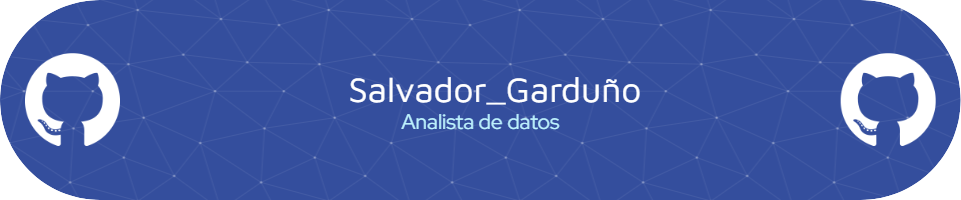

  <h1 align="center">  </h1>
  <h3 align="center"> Un apasionado por descifrar las historias que nos narran los datos.</h3>
  
  

  
  
  
  ---
  
  <h3> Acerca de Mí : 📑 </h3>
  
  

    
- Actualmente me estoy preparando para la certificación **[DP-600](https://learn.microsoft.com/es-es/credentials/certifications/exams/dp-600/) "Implementación de soluciones de análisis con Microsoft Fabric"** 
    
- Me gusta mucho el análisis exploratorio de los datos (EDA) 
    
- Suelo utilizar las siguientes librerias: **seaborn, pandas, Numpy, Matplotlib** 📚
    
- Me puedes contactar atráves de mi email personal: **salvador.david.grdz@gmail.com** 📧
  
  

  <h3>Lenguajes y Herramientas: 🏗️</h3>
  

      &nbsp;
       &nbsp;
      &nbsp;
      &nbsp;
      &nbsp;
      &nbsp;
      &nbsp;
      &nbsp;
       &nbsp;
       &nbsp; 
       &nbsp; 
       &nbsp; 
      
  

---

  
  <h3> Certificados: 🏆 </h3>
  
  

       &nbsp;
        &nbsp;
        &nbsp;
        &nbsp;
        &nbsp;
    
  

---

<h3> Lenguajes más usados en mis proyectos: ✔️ </h3>

  

